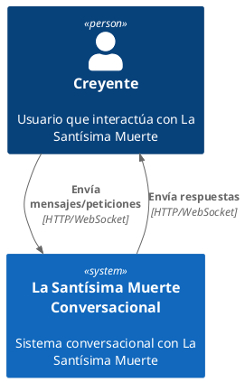
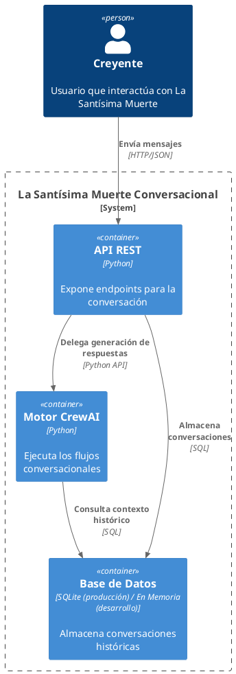
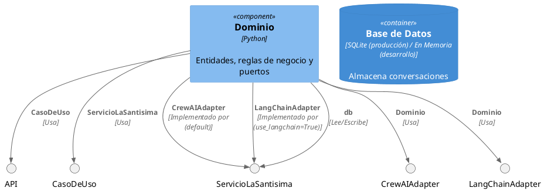

# Arquitectura del Sistema La Santísima Muerte Conversacional

## Diagrama de Contexto (C4 Nivel 1)



## Diagrama de Contenedores (C4 Nivel 2)



## Diagrama de Componentes (C4 Nivel 3)



### CrewAIAdapter y LangChainAdapter: paridad funcional, motores intercambiables

Ambos adaptadores implementan el mismo puerto `ServicioLaSantisima` (DIP) y
tienen el mismo comportamiento observable para el creyente: clasificación de
intención/emoción con enrutado (vacío/incompleto/válido), sliding window de
historial, memoria persistente actualizada en background, streaming y
degradación validada con fallback ante error o respuesta de baja calidad.

Lo que antes era lógica de negocio atrapada dentro de `CrewAIAdapter` (o
directamente ausente en `LangChainAdapter`) ahora vive en el dominio,
reutilizada por ambos motores:

- `domain/conversacion.py`: `aplicar_sliding_window`, `extraer_resumen_persistente`.
- `domain/degradacion.py`: `validar_o_usar_fallback`, la política de
  aceptar o degradar una respuesta antes de entregarla al creyente.
- `infrastructure/prompts.py`: el prompt de fallback, compartido para que
  ambos motores degraden al mismo tono cuando el principal falla.

`CrewAIAdapter` expresa su flujo declarativamente en `flow.json` (editable
sin tocar Python); `LangChainAdapter` lo expresa como cadenas LCEL
compuestas explícitamente en Python, con enrutado if/else en vez de un
grafo con estado (LangGraph): para 3 ramas sin ciclos entre turnos no se
justifica la dependencia adicional.

**Nota histórica — rama de crisis emocional grave (retirada 2026-09-15):**
ambos motores tuvieron una rama especial que interceptaba mensajes con
emoción `"desesperacion"` y devolvía un texto fijo de contención +
derivación en vez de pasar por el LLM (`domain/crisis.py`, ya eliminado).
Se retiró por decisión del titular del proyecto: disparaba con angustia
cotidiana, no solo riesgo vital, y el texto fijo se sentía repetitivo y
no contextual. Ver `docs/compliance/gobernanza-ia.md` §4 y la entrada
"Reversión 2026-09-15" en §6 para el detalle completo, incluida la
condición de revisión pendiente antes de cualquier lanzamiento público.
`flow.json` ya no tiene ningún nodo cuyo contenido no sea la fuente final
de verdad de la respuesta: el enrutado if/else de `LangChainAdapter` y el
flujo declarativo de `CrewAIAdapter` vuelven a tener paridad total sin
excepciones.

## Backend HTTP, seguridad y operación

Componentes agregados para que el sistema sea un backend desplegable (no
solo una librería Python), en orden de dependencia:

- `config.py`: `Settings` (pydantic-settings), única fuente de
  configuración vía entorno (`SANTISIMA_*` + `OPENAI_API_KEY`). Falla al
  arrancar si falta algo requerido (fail-fast) en vez de fallar en el
  primer mensaje de un usuario real.
- `infrastructure/dispositivos.py` + `infrastructure/security.py`:
  identidad por **dispositivo** para el usuario final (`device_token`,
  emitido sin login al registrarse vía `POST /api/v1/dispositivos` —
  pensado para Android/iOS/web público, donde una API key embebida en el
  cliente se podría extraer del binario) y `session_id` firmados con HMAC
  atados a ese dispositivo — un cliente no puede fabricar ni reutilizar el
  `session_id`/`device_token` de otro. API key (`Authorization: Bearer`)
  queda reservada a endpoints de administración (`/admin/*`, p. ej.
  revocar un dispositivo abusivo), nunca distribuida en la app.
- `infrastructure/rate_limit.py`: límite de mensajes por minuto por API
  key (ventana deslizante en memoria; documenta su propio límite de
  escalado horizontal).
- `infrastructure/logging_config.py`: logging estructurado (JSON por
  línea) al stdout del proceso.
- `presentation/http_api.py`: FastAPI que ata todo lo anterior a
  `CasoDeUsoResponderMensaje` vía HTTP — endpoints de sesión, mensaje
  (síncrono y SSE), salud/degradación (`/health/ready` refleja
  `esta_degradado` del adapter activo) y aviso de privacidad.
- `docs/privacidad.md` + `scripts/purgar_retencion.py`: aviso de
  privacidad y purga periódica según `SANTISIMA_RETENCION_DIAS`, sobre
  contenido cifrado en reposo (`SANTISIMA_CLAVE_CIFRADO`,
  `SQLiteConversationRepository`).

`MensajeCreyente` (dominio) valida longitud máxima y filtra caracteres de
control en la entrada del creyente — antes solo se validaba la salida del
LLM, nunca lo que el usuario enviaba.

## Estructura de Código

```
src/
  la_santisima_conversacional/
    domain/               # Modelos y reglas de negocio
    application/          # Casos de uso y servicios
    infrastructure/       # Implementaciones concretas
    presentation/         # Puntos de entrada (API, CLI)
```